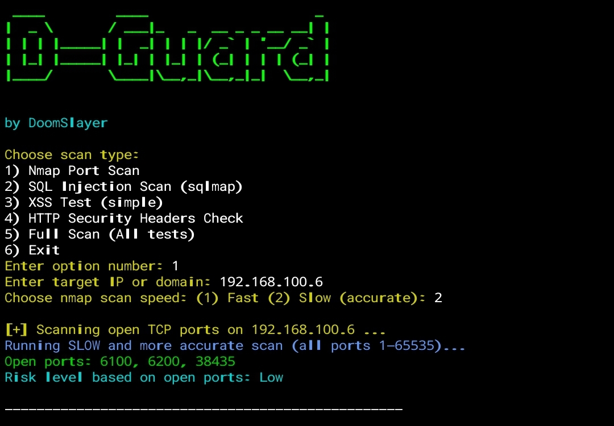

# D-Guard

D-Guard is a terminal-based security scanning tool developed by DoomSlayer.  
It performs multiple types of scans including port scanning, SQL injection testing, XSS testing, and HTTP security headers checking.

---

## Features

- Clean and colorful interactive terminal interface.  
- Supports quick and slow scans with timeout customization.  
- Summary reports with risk levels for each scan.  
- Easy to exit anytime by typing `exit` or `quit`.  
- Uses popular tools like nmap and sqlmap for accurate scanning.

---
## The tool :

---

## Requirements

- Python 3.x  
- colorama  
- requests  
- pyfiglet  
- nmap (system tool)  
- sqlmap (system tool)

---

## Installation

1. Clone the repository:  
```bash
git clone https://github.com/DoOmSlAeYr/D-GuardProject.git
```
step 2 :
```bash
cd D-GuardProject
```
step 3 :
```bash
pip3 install -r requirements.txt
```
step 4 : 
```bash
python3 D-Guard.py
```
## Congratulations!

author : DoomSlayer
